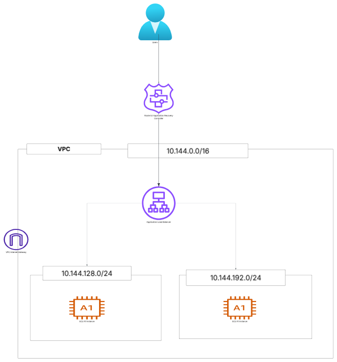

# AWS Architecture Free Tools
- [LuiChart](https://lucid.app/documents#/home?folder_id=recent)

# AWS VPC Configuration
- Create VPC within a defined CIDR like
```shell
10.144.0.0/16
```
- Create two subnets those are private subnets
```shell
10.144.128.0/24 -> private 
10.144.192.0/24 -> private
```
- Create Route Table and associate the subnets where we want to transfer traffic.
- To allow internet access, then Create Internet-Gateway within VPC
- 