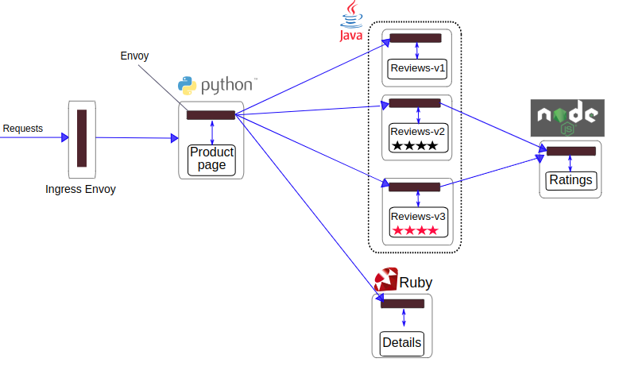

# Following below architecture to implement the cilium network policy

## Installation With Kube Proxy replacement
```shell
cilium install --version=1.18.4 \
--set k8sServiceHost=172.31.4.154 \
--set k8sServicePort=6443 \
--set kubeProxyReplacement=true
```
### Architecture
